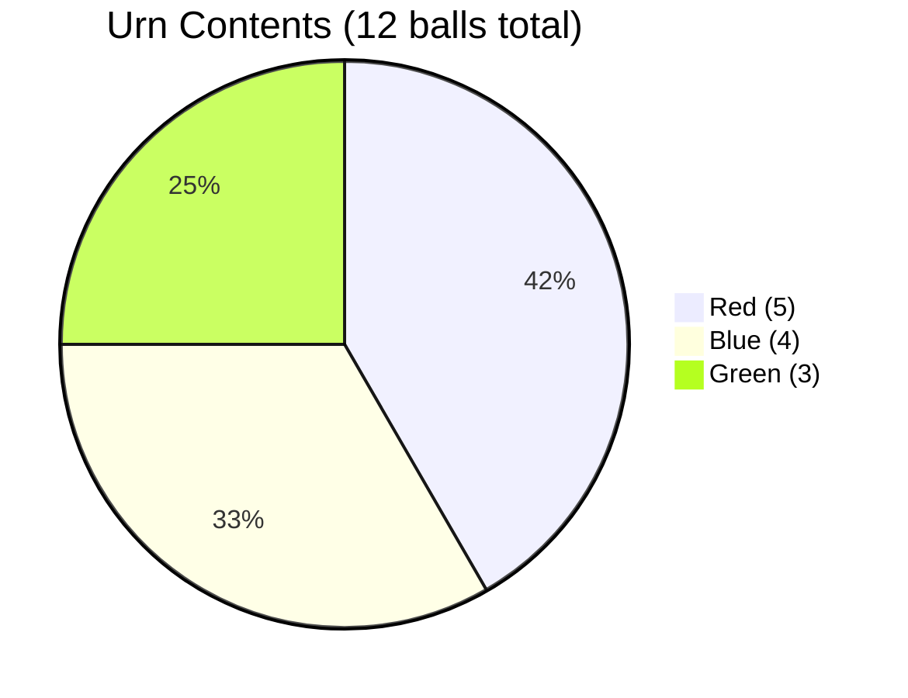

# Solution

## Task 10 — Urn Models

The urn contains a total of $5 + 4 + 3 = 12$ balls.

1. **Three balls are drawn without replacement. How many samples are possible if order is ignored?**
   We are selecting a subset of 3 balls out of 12 (since each ball is drawn physically, we treat them as distinct elements for the sample space). This is a combination.
   $$\binom{12}{3} = \frac{12!}{3! \times 9!} = \frac{12 \times 11 \times 10}{6} = 220$$

2. **How many samples contain exactly two red balls?**
   We must choose exactly $2$ out of the $5$ red balls, and $1$ out of the $7$ non-red balls (blue and green).
   Order doesn't matter:
   $$\binom{5}{2} \times \binom{7}{1} = 10 \times 7 = 70$$

3. **Three balls are drawn and the order of colors is recorded. How many outcomes are possible?**
   Assuming treating individual balls as distinct to keep probabilities uniform, we select 3 balls out of 12 respecting order. This is a k-permutation:
   $$P(12, 3) = 12 \times 11 \times 10 = 1,320$$

4. **How many outcomes contain exactly two red balls?**
   The positions of the two red balls can be chosen in $\binom{3}{2} = 3$ ways. E.g., $(R, R, X), (R, X, R), \text{ or } (X, R, R)$.
   For any specific arrangement pattern, the number of ways to pick the actual 2 red balls in order is $P(5, 2) = 5 \times 4 = 20$.
   The number of ways to pick the 1 non-red ball is $P(7, 1) = 7$.
   $$3 \times 20 \times 7 = 420$$

<br>

### Experiment Visualization (Python Simulation & Diagram)

We can visualize the urn's composition and verify our theoretical combinatorics results using a short Python simulation to experimentally approximate the probabilities.



**Simulation Script:**

```python
import random

def simulate_urn_draws(num_trials=100000):
    # Represent the urn: 5 Red (R), 4 Blue (B), 3 Green (G)
    urn = ['R']*5 + ['B']*4 + ['G']*3
    
    # Track results
    exactly_two_red = 0
    
    for _ in range(num_trials):
        # Draw 3 balls without replacement
        sample = random.sample(urn, 3)
        
        # Check condition: exactly 2 red balls drawn
        if sample.count('R') == 2:
            exactly_two_red += 1
            
    # Experimental Probability
    prob_two_red = exactly_two_red / num_trials
    
    # Theoretical Probability
    # 70 ways to get exactly 2 red balls out of 220 total combinations
    theoretical_prob = 70 / 220
    
    print(f"--- Simulation Results ({num_trials} trials) ---")
    print(f"Experimental P(exactly 2 red) = {prob_two_red:.4f}")
    print(f"Theoretical P(exactly 2 red)  = {theoretical_prob:.4f}")
    print(f"% Error = {abs(prob_two_red - theoretical_prob) / theoretical_prob * 100:.2f}%")

# Run the simulation
simulate_urn_draws()
```
